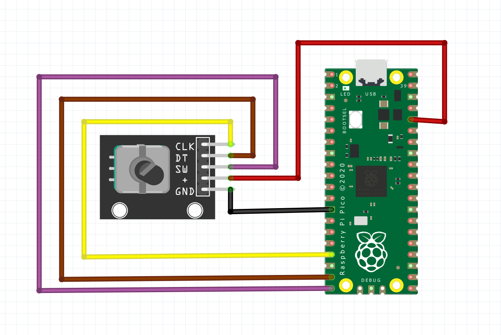

# MultiMediaKnob 🚀: Autonomous HID Control Dial

A highly configurable, autonomous rotary encoder (**MultiMediaKnob**) built with a Raspberry Pi Pico (CircuitPython) and a sleek PC configurator app (**KnobStudio**) built with Python/CustomTkinter.

This project has evolved from a simple media controller into a powerful control station, now featuring **Shift Layers**, **Multi-Click Actions** (double/triple), **Mouse Control**, and a full **Sequential Macro Engine**.



*The modern, dark-themed KnobStudio app.*

---

## 🚀 Features

* **⚡ Autonomous HID:** The knob works as a standalone USB device (Keyboard, Media Controller, **and Mouse**) without any PC software running in the background.
* **💨 Zero Lag:** By acting as a native HID, all actions (volume, scroll) are instant, with no lag or buffering.
* **🚦 3 Profiles + Shift Layers:** Switch between three independent profiles. Each profile now has **two "layers"**, giving you 6 distinct rotation actions.
* **🎨 Deep Customization:** Configure actions for **8 different gestures** per profile:
    * Rotate Clockwise (CW)
    * Rotate Counter-Clockwise (CCW)
    * Short Click
    * **NEW: Double Click**
    * **NEW: Triple Click**
    * Long Press
    * Hold + CW (Shifted)
    * Hold + CCW (Shifted)
* **⌨️ Advanced Sequential Macro Engine:** Go beyond simple shortcuts. The new script-based editor allows you to create **multi-step sequences** for complex automation. Assign a sequence of actions like `press CTRL`, `wait 100ms`, `tap C`, `release_all` to any of the 8 available gestures.
* **🖱️ Native Mouse Control:** Use the knob for vertical/horizontal scroll, pointer movement, or clicks (left, right, middle).
* **🎚️ Per-Action Sensitivity:** Set different "steps per click" (1x-10x) independently for **Volume**, **Scroll**, and **Mouse** movements.
* **🖥️ Modern UI (KnobStudio):** A sleek, dark-mode app (`customtkinter`) to easily set up all your profiles, sensitivities, and macros.
* **💾 Simple "Save & Reboot":** The app saves your settings directly to a `profiles.json` file on the Pico's `CIRCUITPY` drive and then sends a serial command to reboot the Pico, loading the new settings instantly.
* **🔄 Persistent On-Device Profile Saving:** **(NEW)** When you switch profiles *using the knob* (e.g., with a 'Next Profile' action), your choice is automatically saved to the Pico's flash. The knob will now boot into the last-used profile.

---

## 🛣️ Future Roadmap

This project is now in a mature stage. The architecture was designed to be modular, allowing for several more exciting features to be added in the future:

* **🖥️ App-Specific Profiles:** A new PC-side agent that detects the active application (e.g., Photoshop, VS Code, Spotify) and automatically signals the Pico to switch to a corresponding profile.
* **📱 Wireless Bluetooth Version:** Developing a hardware revision (likely with a Pico W) to create a fully wireless, battery-powered version of the knob using Bluetooth LE (HID).
* **🐧 Linux & macOS Support:** Porting the `KnobStudio` configurator app to be cross-platform, resolving current Windows-specific dependencies (like `pywin32`) for drive and port detection.
* **🌈 RGB LED Profile Indicator:** The next planned hardware addition is an RGB LED (like a NeoPixel). This will provide instant visual feedback on the active profile by changing color (e.g., Profile 1 = Red, Profile 2 = Green).
* **📺 OLED Display Integration:** An I2C OLED screen (like an SSD1306) can be added to display dynamic information, such as custom profile names ("Volume", "Editing", "Gaming").
* **👋 Per-Action Haptic Feedback (Advanced):** Integrating a small vibration motor to provide tactile feedback on action execution or profile switching.

---

## 🛠️ How It Works

This project uses a "Configurator" model, which combines the speed of HID with the flexibility of a GUI.

### The Pico (The "Muscle"): Runs `code.py`

1.  On boot, it reads a `profiles.json` file from its own storage to load its configuration.
2.  It initializes itself as a USB Keyboard, Media Controller, & **Mouse (HID)**.
3.  When you turn or press the knob, a new **advanced state machine** differentiates between a **single click, double click, triple click**, a long press, and a "shifted" (hold+rotate) action.
4.  It sends the corresponding **direct HID command** (e.g., `Volume Up`, `Mouse Scroll`, or a complex, **multi-step macro sequence**) to the PC.
5.  When a profile is changed *on the knob*, it re-mounts its filesystem, **saves the new default profile to `profiles.json`**, and continues.
6.  It also listens on its Data Serial Port for one specific command: `"REBOOT"`.

### The PC App (KnobStudio): Runs `KnobStudio.py`

1.  This app **does not** need to run in the background.
2.  When you click "Save & Reboot Pico":
    * It finds the Pico's `CIRCUITPY` USB drive (using `psutil`).
    * It writes your new settings (profiles, sensitivity, and all simple/advanced macros) to the `profiles.json` file (using the latest multi-action structure).
    * It finds the Pico's Data Serial Port (using `pyserial`).
    * It sends the text command `"REBOOT"` over the serial port.
3.  The Pico receives the command, reboots, reads the *new* `profiles.json`, and is ready with the new settings.

---

## 🔌 Hardware & Wiring

(This remains unchanged from the original version)

* Raspberry Pi Pico
* Rotary Encoder Module (KY-040 or similar, 5-pin)
* Breadboard and jumper wires

### Wiring Diagram

* **Encoder `GND`** -> Pico `GND` (e.g., Pin 38)
* **Encoder `+` (VCC)** -> Pico `3.3V(OUT)` (Pin 36)
* **Encoder `SW` (Switch)** -> Pico **`GP15`** (Pin 20)
* **Encoder `DT` (Data)** -> Pico **`GP14`** (Pin 19)
* **Encoder `CLK` (Clock)** -> Pico **`GP13`** (Pin 17)

---

## ⚙️ Requirements

### Pico (Hardware)

1.  **Raspberry Pi Pico:** A Pico or Pico W.
2.  **CircuitPython:** The code is written for CircuitPython. Ensure you have the latest version of [CircuitPython for your Pico](https://circuitpython.org/board/raspberry_pi_pico/) installed.
3.  **CircuitPython Libraries:** After installing CircuitPython, copy the following library from the [CircuitPython Library Bundle](https://circuitpython.org/libraries) to the `lib` folder on your `CIRCUITPY` drive:
    * `adafruit_hid`

### PC (KnobStudio App)

The Configurator app (`KnobStudio.py`) is written in Python 3 and requires the following libraries. You can install them all by running:

```bash
pip install customtkinter psutil pyserial pywin32
